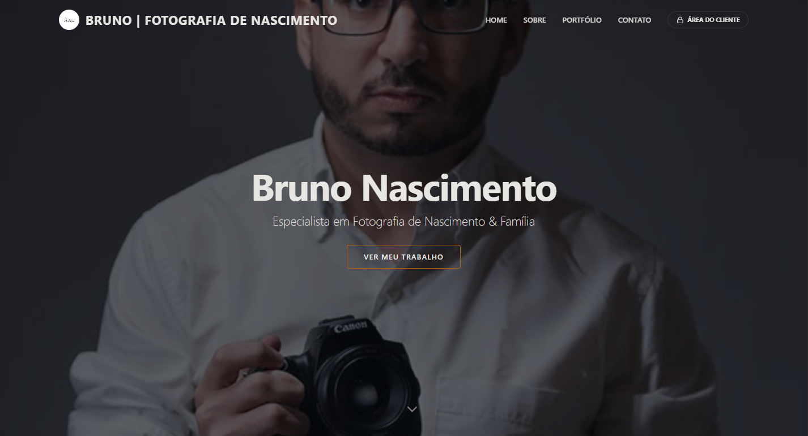

   
  <h1><b>Bruno Nascimento Fotografia</b></h1>
  
✨ Um portfólio web de luxo para fotógrafos, combinando design elegante e tecnologia de ponta para criar uma vitrine digital inesquecível. ✨

   

  
  
  
  
  
  

  

## ✨ Visão Geral
 
Este projeto é uma aplicação **full-stack** que transcende o conceito de um simples site. Ele oferece uma experiência digital completa: uma vitrine pública para exibir seu trabalho, uma área de cliente exclusiva para entrega de galerias privadas e um painel de controle intuitivo para gerenciamento total do conteúdo.

## 🎥 Vídeo de Apresentação

Confira o vídeo de apresentação do sistema: [Assistir no YouTube](https://www.youtube.com/watch?v=lI_d72VdcoY)

> **Nota:** Este repositório pode servir como um template completo e robusto para outros fotógrafos ou profissionais criativos que desejam ter uma presença online profissional e autogerenciável.

## 🚀 Funcionalidades Principais

*   🎨 **Galeria de Portfólio**: Exibição de trabalhos com navegação por categorias.
*   👤 **Página "Sobre Mim"**: Espaço com foto e biografia para apresentação do profissional.
*   📧 **Formulário de Contato**: Canal direto para orçamentos e informações.
*   🔐 **Área do Cliente**: Sistema de acesso seguro onde clientes visualizam suas galerias privadas utilizando um código de acesso exclusivo.
*   🔗 **Integração com Plataformas de Seleção**: Funcionalidade de link externo que permite integrar a entrega de fotos com plataformas especializadas (como Selpics), mantendo o acesso centralizado pelo seu site.
*   ⚙️ **Painel Administrativo**: Área restrita para o fotógrafo criar álbuns, gerenciar senhas de acesso e fazer upload de fotos (drag-and-drop).
*   📱 **Design Responsivo**: Experiência de usuário otimizada para desktops, tablets e celulares.
*   📲 **Aplicativo Móvel**: Aplicativo nativo para Android e versão otimizada (PWA) para iOS, permitindo que clientes instalem o portfólio diretamente em seus dispositivos.

## 🛠️ Tecnologias Utilizadas

O projeto foi construído com um stack moderno, separando claramente as responsabilidades entre o frontend e o backend.

### **Frontend**
*    **React**
*    **TypeScript**
*    **Vite**
*    **Tailwind CSS**
*   **Componentes UI**: shadcn/ui
*   **Mobile**: Capacitor (Android/iOS PWA)
*   **Animações**: Framer Motion

### **Backend & Infraestrutura**
*    **Supabase**
*    **PostgreSQL**

## 🔒 Licença e Direitos Autorais

**© 2026 Bruno Nascimento Fotografia e inovedev.com.br. Todos os direitos reservados.**

Este software é um produto comercial proprietário. O uso, cópia, modificação, distribuição ou engenharia reversa deste código-fonte, no todo ou em parte, sem a autorização expressa e por escrito do proprietário, é **estritamente proibido**.

Este projeto não é open-source. Ele é destinado exclusivamente para uso comercial autorizado. Violações de direitos autorais serão processadas conforme a lei.
